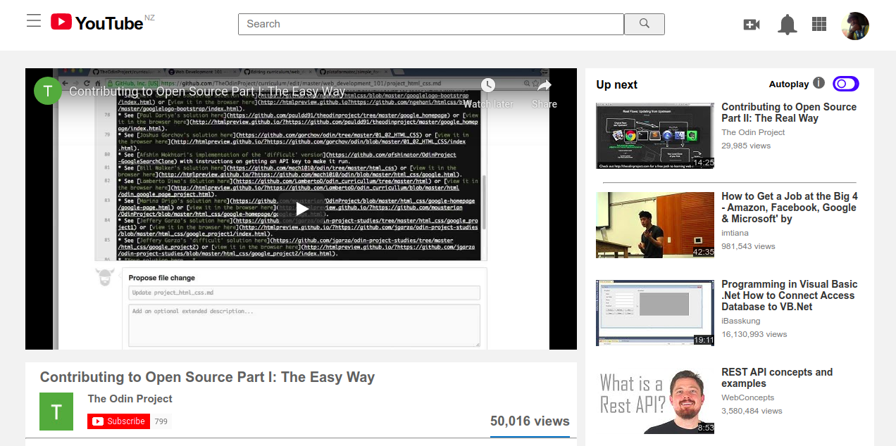

# Embedding Images and Video

This project consists of building an HTML document that matches the appearance of youtube [video player page](https://www.youtube.com/watch?v=V74l_zS1x8E).

## Screenshots

## Project Description

<https://www.theodinproject.com/courses/html5-and-css3/lessons/embedding-images-and-video>

## Run locally

1. Clone the project- git clone <https://github.com/bafiam/project1-youtubeClone.git>
2. Cd youtube-clone
3. Run index.html on your browser

## Built With

1. HTML5
2. CSS3

## Github Pages Link

<https://bafiam.github.io/project1-youtubeClone/>

## License

This project is licensed under the MIT License - see the [LICENSE.md](LICENSE.md) file for details.

## Authors

1. [Stephen Gumba](https://github.com/bafiam)
2. [Iyara Oghenefegor Ferguson](https://github.com/fegzycole)

## Acknowledgments

* Microverse.
